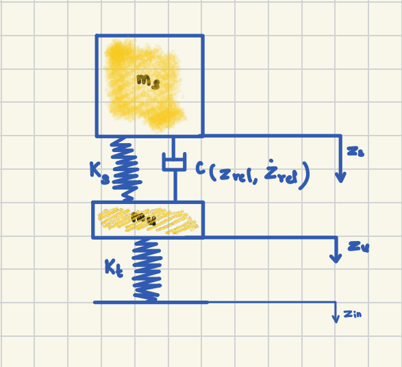
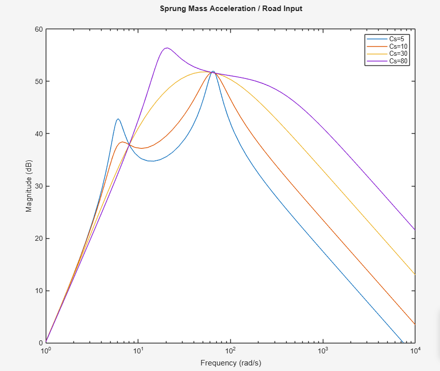
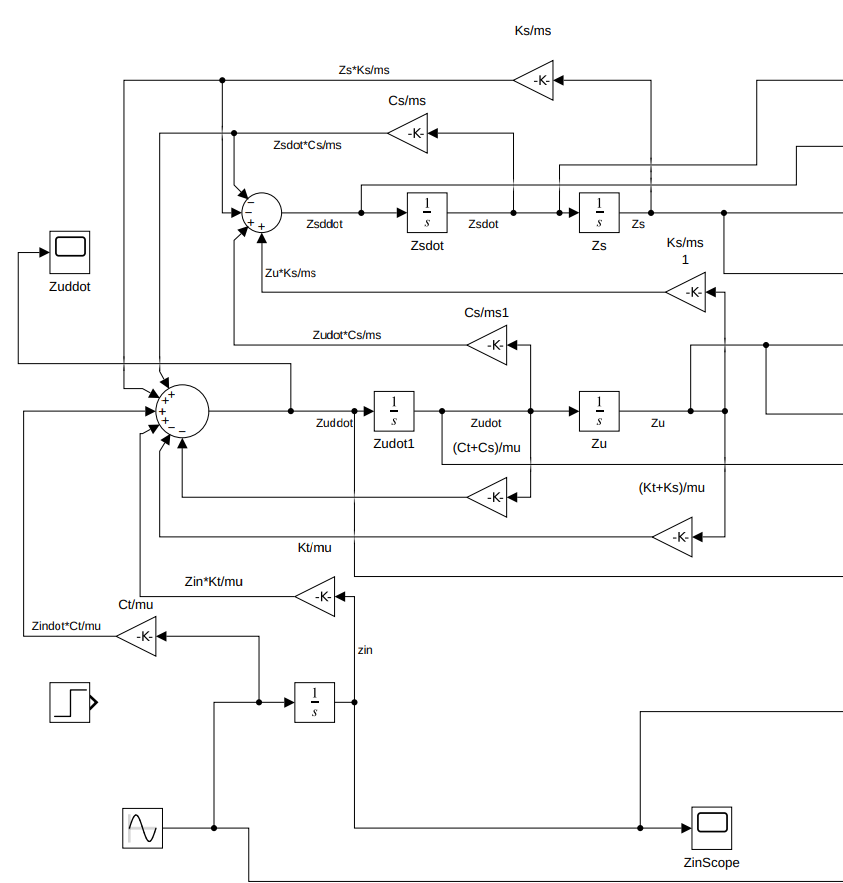
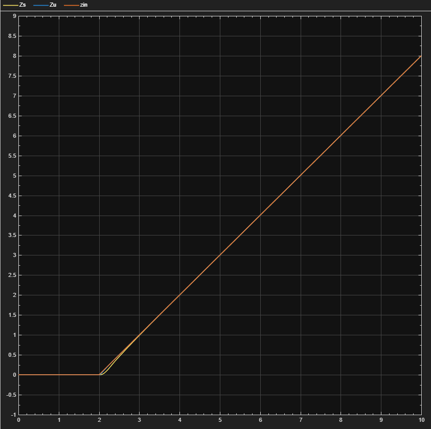
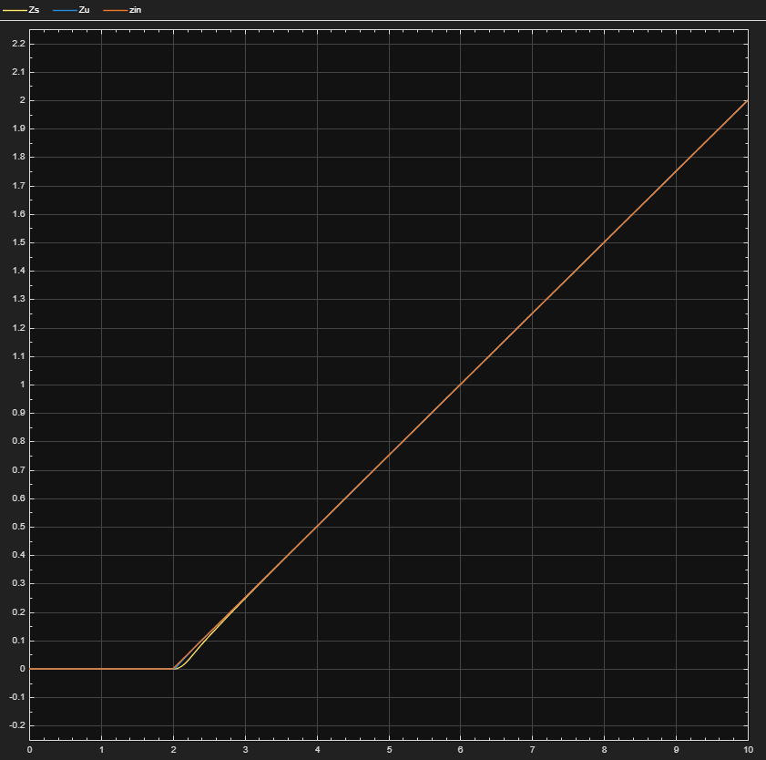
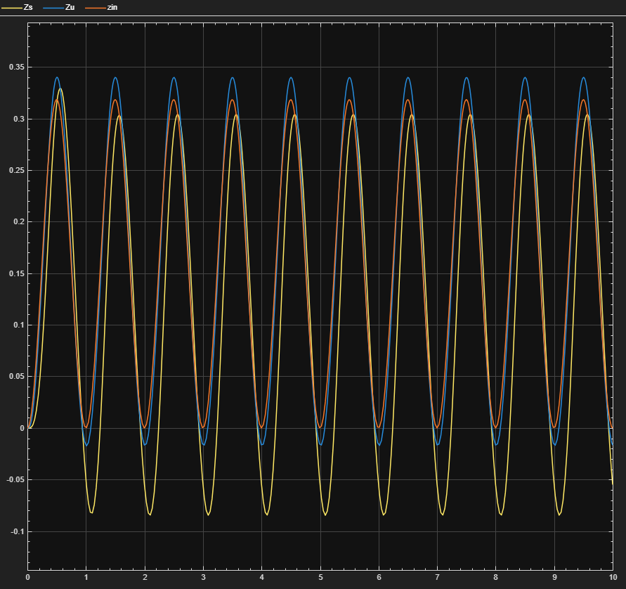
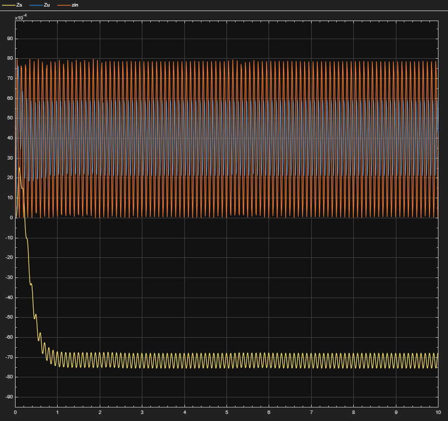
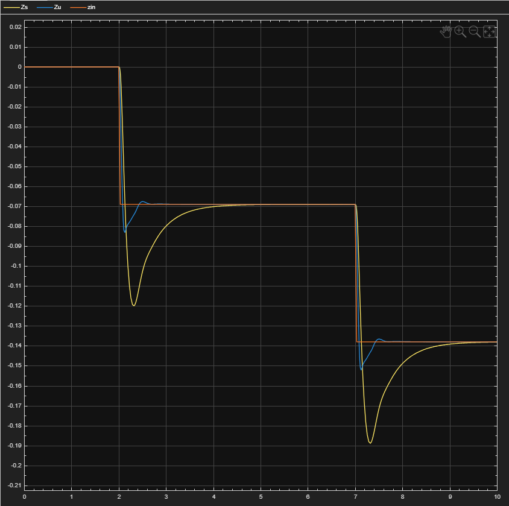
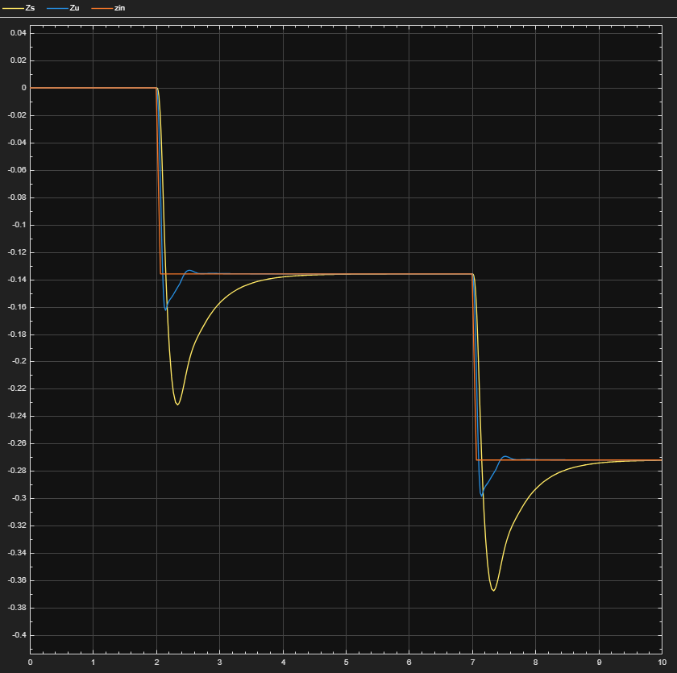

# Quarter-Car Suspension Simulation
### Linear and Nonlinear Damping Analysis

This project investigates the dynamics of a two-mass quarter-car suspension system using both **linear and nonlinear damping models**. The goal is to determine an optimal damping configuration that minimizes vibration transmission from road disturbances to the vehicle body.

The system was modeled and simulated using **MATLAB and Simulink**.

---

# Project Overview

A **quarter-car suspension model** represents one wheel of a vehicle and consists of:

- Sprung mass (vehicle body)
- Unsprung mass (wheel assembly)
- Suspension spring
- Tire stiffness
- Suspension damper

The objective is to:

- Analyze suspension performance using **frequency response**
- Determine an **optimal linear damping coefficient**
- Compare with a **nonlinear damping strategy**
- Evaluate ride comfort under various road disturbances

---

# Mathematical Model

The system dynamics are described using two second-order differential equations.

## Sprung Mass

$$
\ddot{z}_s =
-\frac{K_s}{m_s} z_s
-\frac{C_s}{m_s} \dot{z}_s
+\frac{K_s}{m_s} z_u
+\frac{C_s}{m_s} \dot{z}_u
$$

## Unsprung Mass

$$
\ddot{z}_u =
\frac{K_s}{m_u} z_s
+\frac{C_s}{m_u} \dot{z}_s
-\frac{K_t + K_s}{m_u} z_u
-\frac{C_t + C_s}{m_u} \dot{z}_u
+\frac{K_t}{m_u} z_{in}
+\frac{C_t}{m_u} \dot{z}_{in}
$$

Where

- $z_s$ : sprung mass displacement  
- $z_u$ : unsprung mass displacement  
- $z_{in}$ : road input disturbance

---

# System Model

Two masses represent the **vehicle body** and **wheel assembly**, connected through a suspension spring and damper.

---

# Frequency Response Analysis

A **Bode magnitude plot** was generated to evaluate different damping coefficients.

Key observations:

- Low damping → large resonance peak
- High damping → increased high-frequency vibration transmission
- Optimal value found near

$C_s \approx 30\ \text{lb-sec/in}$

---

# Simulink Implementation

The quarter-car model was implemented in **Simulink using state-space equations**.

  

Two cascaded integrators represent the **velocity and position states** of the sprung and unsprung masses.

---

# Time-Domain Simulation

Using the optimal damping value, the suspension response was simulated for sinusoidal road input.

.png)

Observations:

- Sprung mass displacement remained smaller than road input
- Oscillations were stable
- The suspension provided effective vibration isolation

---

# Nonlinear Damping Model

To improve performance during large disturbances, a **nonlinear damping model** was introduced:

$$
C(z_{rel}, \dot{z}_{rel}) =
\begin{cases}
C_c + k\,|z_{rel}|, & \dot{z}_{rel} > 0 \\
C_r + k\,|z_{rel}|, & \dot{z}_{rel} \le 0
\end{cases}
$$

where

$$
z_{rel} = z_u - z_s
$$

Parameters used:

Parameters used:

- $C_c = 20$
- $C_r = 50$
- $k = 5$

---

# Simulation Scenarios

The nonlinear model was evaluated using several road disturbances:

1. 1 inch step input at 0.5 Hz  
2. 1/4 inch step input at 0.5 Hz  
3. ±1 inch sinusoidal input at 1 Hz  
4. ±1/4 inch sinusoidal input at 10 Hz  
5. 2 inch pothole disturbance (3 ft wide) at 60 mph  
6. 2 inch pothole disturbance (3 ft wide) at 30 mph  

---

# Results

### Step Input Response - 1 inch step input at 0.5 Hz 

### Step Input Response - 1/4 inch step input at 0.5 Hz 

### Sinusoidal Road Input -  ±1 inch sinusoidal input at 1 Hz

### Sinusoidal Road Input - ±1/4 inch sinusoidal input at 10 Hz

### Pothole Disturbance - 2 inch pothole disturbance (3 ft wide) at 60 mph

### Pothole Disturbance - 2 inch pothole disturbance (3 ft wide) at 30 mph

Key observations:

- Nonlinear damping reduced rebound oscillations after pothole disturbances
- Ride comfort remained similar for sinusoidal inputs
- Suspension deflection remained within acceptable limits

The nonlinear damping model demonstrated improved disturbance rejection
during pothole events while maintaining comparable ride comfort
under sinusoidal road inputs.

---

# Key Takeaways

- Frequency response analysis identified an **optimal linear damping coefficient**
- Nonlinear damping improved response to **large road disturbances**
- The nonlinear suspension model **reduced oscillations while maintaining ride comfort**

## Tools Used

- MATLAB
- Simulink
- Control System Toolbox

---

